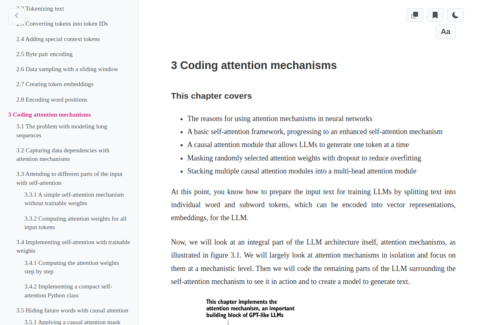
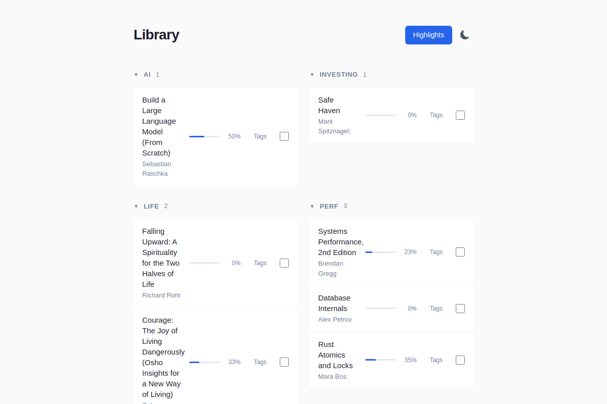
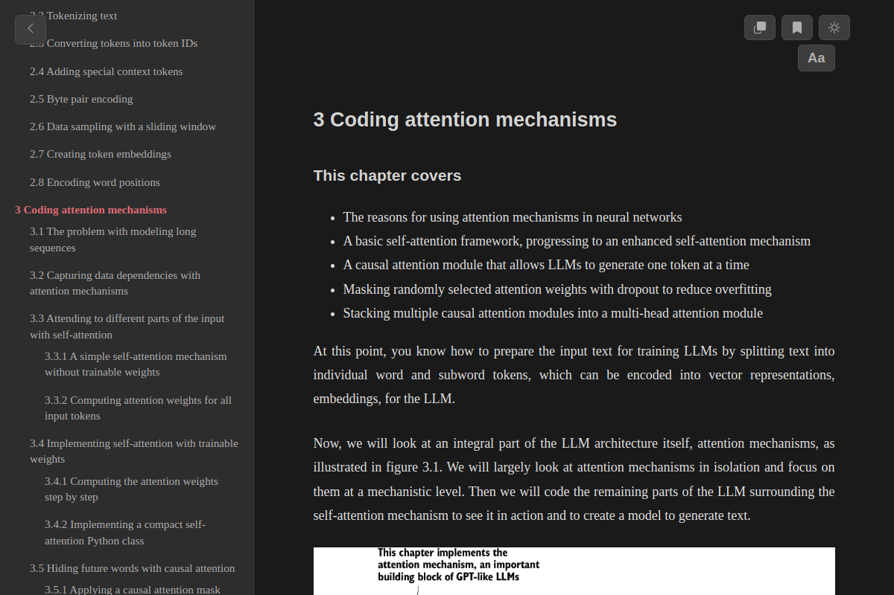
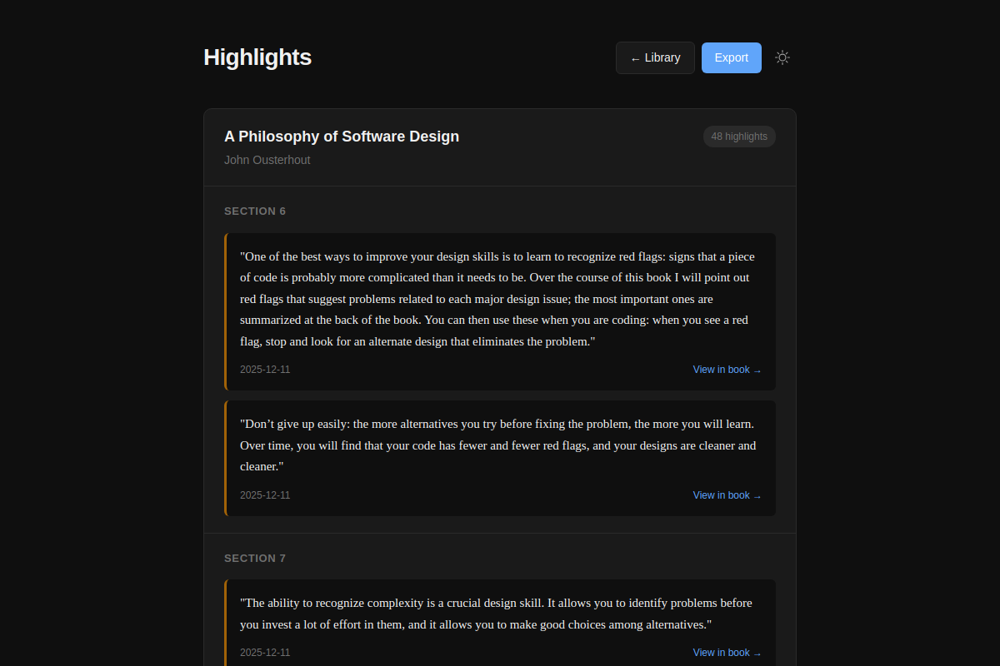
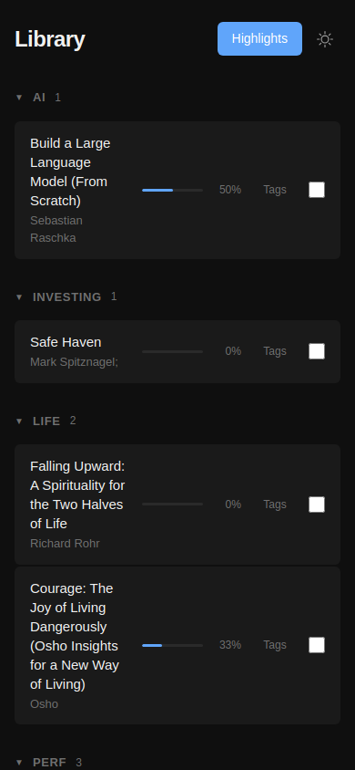

<div align="center">

# LLMReader

**A lightweight, self-hosted EPUB reader designed for reading with AI**

*Read books one chapter at a time, copy-paste to your favorite LLM, and deepen your understanding*

[](LICENSE)



</div>

---

## Why LLMReader?

> I'm starting to get into a habit of reading everything (blogs, articles, book chapters,…) with LLMs. Usually pass 1 is manual, then pass 2 "explain/summarize", pass 3 Q&A. I usually end up with a better/deeper understanding than if I moved on.
>
> — *[Andrej Karpathy](https://x.com/karpathy/status/1990577951671509438)*

This project illustrates how you can easily read books together with LLMs. Get EPUB books (e.g. from [Project Gutenberg](https://www.gutenberg.org/)), open them in this reader, copy-paste text to your favorite LLM, and read together.

**Supported formats:** EPUB and PDF

---

## Features

<table>
<tr>
<td width="50%">

### Library Management

Organize your books with tags, track reading progress, and pick up where you left off.

- Grid-based library with cover images
- Tag system for organization
- Reading progress tracking
- Drag & drop upload

</td>
<td width="50%">



</td>
</tr>
</table>

<table>
<tr>
<td width="50%">



</td>
<td width="50%">

### Reading Experience

Clean, distraction-free reading with powerful navigation.

- **One-click copy** — Copy entire chapter for LLM
- **Dark mode** — Easy on the eyes
- **Interactive TOC** — Jump to any section
- **Font settings** — Customize size and family

</td>
</tr>
</table>

<table>
<tr>
<td width="50%">

### Highlights & Annotations

Select text to highlight, add notes, and export everything.

- Persistent highlights across sessions
- Notes for each highlight
- Export to Obsidian/Roam markdown
- View all highlights in one place

</td>
<td width="50%">



</td>
</tr>
</table>

<table>
<tr>
<td width="70%">

### Mobile Optimized

Full-featured reading experience on any device.

- Touch-optimized text selection
- Responsive layout
- Overlay sidebar navigation

</td>
<td width="30%">



</td>
</tr>
</table>

---

## Quick Start

The project uses [uv](https://docs.astral.sh/uv/).

```bash
# Process a book
uv run reader3.py your-book.epub

# Start the server
uv run server.py
```

Visit [localhost:8123](http://localhost:8123/) to see your library.

### Make Targets

| Command | Description |
|---------|-------------|
| `make start` | Run the server (auto-installs deps if needed) |
| `make stop` | Stop the server |
| `make add_book BOOK=/path/to/book.epub` | Process a book locally |

### Upload via UI

Open the Library page and drag & drop your `.epub` or `.pdf` files to import.

---

## Keyboard Shortcuts

| Shortcut | Action |
|----------|--------|
| `Cmd+Shift+P` / `Ctrl+Shift+P` | Toggle sidebar |

---

## License

MIT

---

<div align="center">

*This project was 90% vibe coded to illustrate how one can very easily [read books together with LLMs](https://x.com/karpathy/status/1990577951671509438). Code is ephemeral now and libraries are over — ask your LLM to change it however you like.*

</div>
